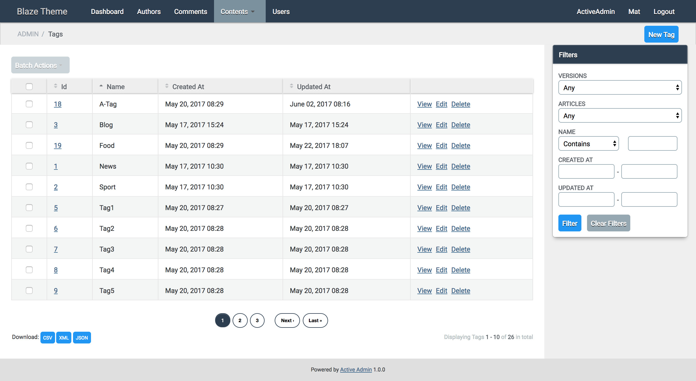

# Active Admin Blaze Theme [](https://badge.fury.io/rb/activeadmin_blaze_theme)

A theme for Active Admin using [Blaze CSS](http://blazecss.com/)

Features:

- clean UI
- compact edit form
- Blaze CSS widgets

## Install

- Add to your Gemfile:

`gem 'activeadmin_blaze_theme'`

- Execute bundle

- Add at the end of your ActiveAdmin styles (_app/assets/stylesheets/active_admin.scss_):

`@import "activeadmin_blaze_theme/theme";`

## Customize

- To change colors add before your ActiveAdmin styles (_app/assets/stylesheets/active_admin.scss_):

```css
/* blaze colors */
$color-brand: #2C3E50;
$color-info: #4dabf5;
$color-warning: #ff9800;
$color-success: #4caf50;
$color-error: #f44336;
/* main variables */
$bg-form1: #f4f4f4;                // bg 1st level forms
$bg-form2: darken($bg-form1, 3%);  // bg 2nd level forms (nested)
$bg-form3: darken($bg-form1, 6%);  // bg 3rd level forms (nested)
$bg-form4: darken($bg-form1, 9%);  // bg 4th level forms (nested)
$bg-form-sub-headings: #d4d4d4;    // bg nested forms title
$bg-header: $color-brand;          // bg header bar
$bg-inputs: #fff;                  // bg forms inputs
$bg-menu-active: #7b929e;          // bg menu item current / hover
$fg-box-title: #fff;
$fg-link2: #eee;
$fg-table-borders: #e4e4e4;
/* other variables */
$form-padding: 10px;
$inputs-spacing: 10px;
$height-inputs: 28px;
$text-shadow: #000;
```

## Screenshots

Index:



Edit:


## Contributors

- [Mattia Roccoberton](http://blocknot.es) - creator, maintainer

## License

[MIT](LICENSE)
