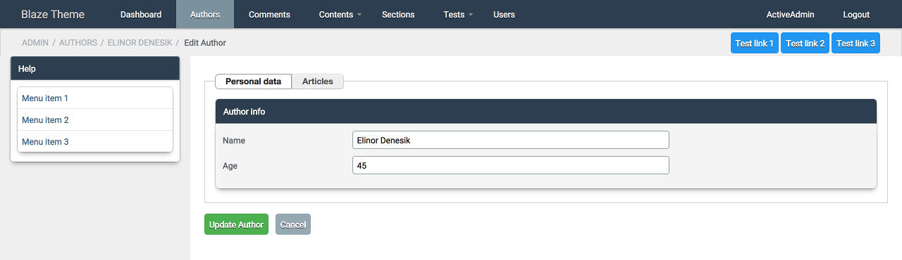
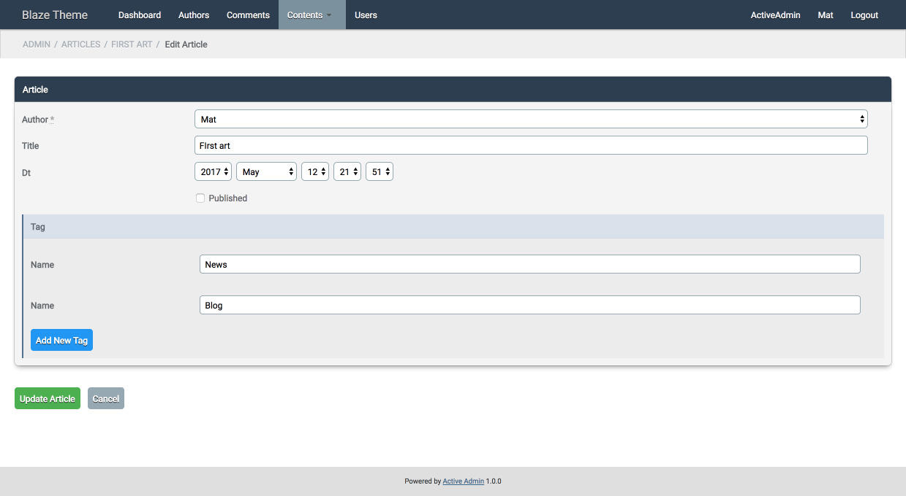
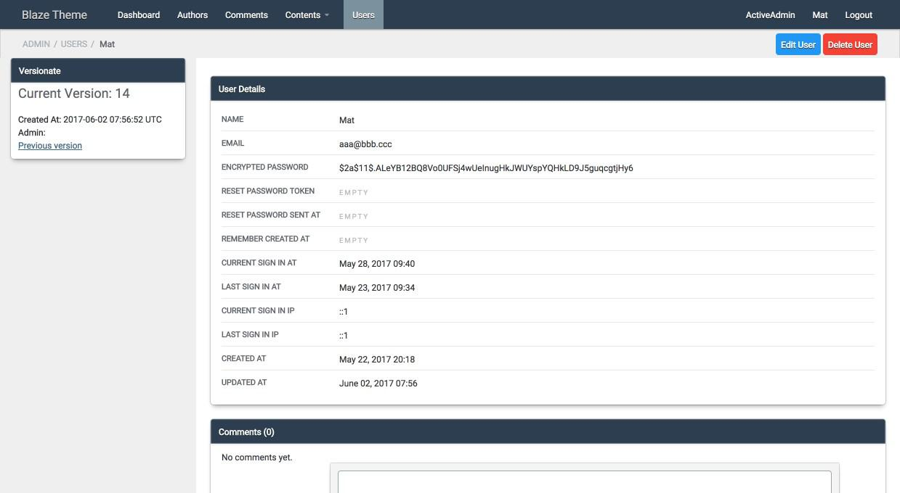

# Active Admin Blaze Theme [](https://badge.fury.io/rb/activeadmin_blaze_theme)

A theme for Active Admin using [Blaze CSS](http://blazecss.com/)

Features:

- CSS only theme with clean UI
- compact nested forms
- [customizable](#customize) options: colors, sidebar position, squared style, scroll on cells
- custom controls / components: [toggle](#toggle), [Sidebar menu](#sidebar-menu), [Accordion](#accordion), [Readonly field](#readonly-field), [Styled table](#styled-table)
- Blaze CSS [widgets](#blaze-widgets)

## Install

- Add to your Gemfile:

`gem 'activeadmin_blaze_theme'`

- Execute bundle

- Add at the end of your ActiveAdmin styles (_app/assets/stylesheets/active_admin.scss_):

`@import "activeadmin_blaze_theme/theme";`

## Customize

- To change colors add before your ActiveAdmin styles (_app/assets/stylesheets/active_admin.scss_):

```css
// blaze colors
$color-brand: #2C3E50;
$color-info: #4dabf5;
$color-warning: #ff9800;
$color-success: #4caf50;
$color-error: #f44336;
// main variables
$bg-footer: #dfdfdf !default;               // bg footer bar
$bg-form1: #f4f4f4 !default;                // bg 1st level forms
$bg-form2: darken($bg-form1, 3%) !default;  // bg 2nd level forms (nested)
$bg-form3: darken($bg-form1, 6%) !default;  // bg 3rd level forms (nested)
$bg-form4: darken($bg-form1, 9%) !default;  // bg 4th level forms (nested)
$bg-form-sub-headings: lighten( $color-brand, 64% ) !default;  // bg nested forms title
$bg-header: $color-brand !default;          // bg header bar
$bg-inputs: #fff !default;                  // bg forms inputs
$bg-menu-active: #7b929e !default;          // bg menu item current / hover
$bg-sidebar: #efefef;                       // bg sidebar
$fg-box-title: #fff !default;
$fg-button-link: #fff !default;
$fg-menu-items: #f8f8f8 !default;
$fg-table-borders: #e4e4e4 !default;
$fg-table-link: #eee !default;
// other variables
$form-padding: 10px !default;
$inputs-spacing: 10px !default;
$height-inputs: 26px !default;
$height-topbar: 40px !default;
$height-titlebar: 38px !default;
$text-shadow: #000 !default;
```

- To move sidebar on the left add to your ActiveAdmin styles (after blaze theme import):

```css
#active_admin_content.with_sidebar {
  @extend .sidebar_left;
}
```

- Squared style (no rounded borders):

```css
#active_admin_content, .active_admin #title_bar {
  @extend .no_rounded;
}
```

- More options:

```css
// scrollable table cells
body.active_admin .index_content table {
  @extend .scrollable_cells;
}
```

```css
// fix ckeditor width
body.active_admin .cke {
  @extend .ckeditor_width_fix
}
```

## Custom fields / components

### Toggle

In *form* \ *inputs* block:

`f.input :boolean, as: :blaze_toggle`

To change toggle color:

`f.input :boolean, as: :blaze_toggle, input_html: { toggle_class: 'c-toggle--brand' }`

Available: `c-toggle--brand, c-toggle--info, c-toggle--warning, c-toggle--success, c-toggle--error`

Standard checkbox with label on the left:

`f.input :boolean, as: :blaze_toggle, input_html: { simple_checkbox: true }`

### Sidebar menu

A sidebar menu (*priority* option permit to put the sidebar above the filters):

```rb
sidebar :help, priority: 0 do
  ul class: 'blaze-menu' do
    li do
      link_to 'Menu item 1', admin_root_path
    end
    li do
      link_to 'Menu item 2', admin_root_path
    end
    li do
      link_to 'Menu item 3', admin_root_path
    end
  end
end
```



### Accordion

An accordion group in a form:

```rb
f.accordion_group do
  f.accordion 'First accordion' do
    f.inputs for: [:detail, f.object.detail || Detail.new] do |f2|
      f2.input :meta_title
      f2.input :meta_keywords
    end
  end
  f.accordion 'Second accordion' do
    f.inputs for: [:more_detail, f.object.morel_detail || Detail.new] do |f2|
      f2.input :meta_title
      f2.input :meta_keywords
    end
  end
end
```

### Readonly field

Some readonly fields in a form:

`f.readonly :position`

`f.readonly :position, f.object.position * 2`

`f.readonly 'Code', 'Automatically set after save', class: 'a-wrapper-class'`

`f.readonly nil, 'Value only, no label'`

### Styled table

Table styles:

```ruby
table_for User.all, class: 'blaze-table table-rows table-striped' do
  # ...
end
```

## Blaze widgets

See components avaible in Blaze CSS [docs](http://blazecss.com/components/buttons/).

Badge example:

```ruby
f.input :price, label: raw( 'Price <span class="c-badge c-badge--warning" style="position: relative; top: -5px">in $</span>' )
```

Button example:

```ruby
a 'clear form', href: '#', class: 'c-button c-button--error', onclick: 'event.preventDefault();document.forms[0].reset();'
```

Progress bar example:

```ruby
div class: 'c-progress' do
  div class: 'c-progress__bar c-progress__bar--success', style: "width: #{f.object.a_field}%;"
end
```

## Screenshots

Index:


Edit:



Show - sidebar on the left:



## Do you like it? Star it!

If you use this component just star it. A developer is more motivated to improve a project when there is some interest.

## Contributors

- [Mattia Roccoberton](http://blocknot.es) - creator, maintainer

## License

[MIT](LICENSE.txt)
